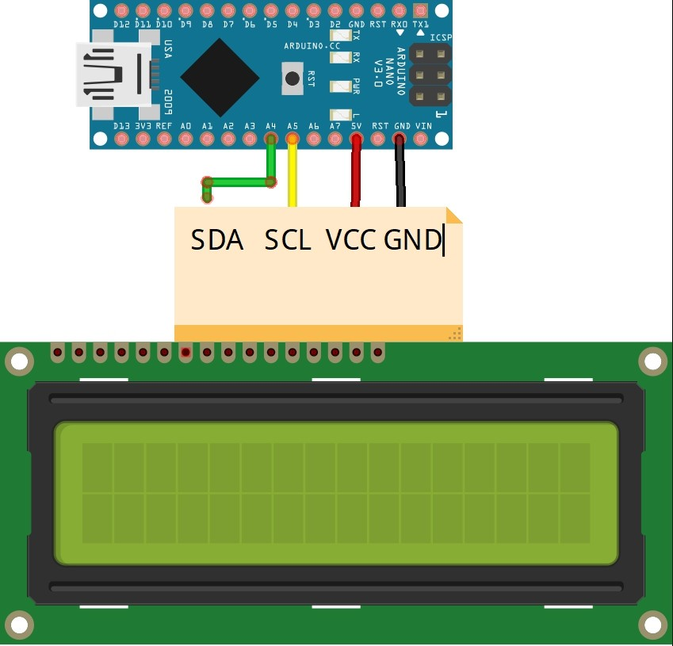

# pc screen shows component load and real time and data
little pc screen, wich very comfortable to analyse your pc load, and check your time

## what is?
just little pc screen for monitor current pc stats, date&time
- date and time to lcd display
  - seconds, minutes, hours, week day, day, month, year
  - way to configure 12h or 24h time mode
- pc components load
  - cpu use percent and temp
  - gpu use percent and temp
  - ram use percent
  - gpu mem percent

## open hardware monitor
used open hardware monitor to get pc telemetry to serial port
repo -> [link](https://github.com/openhardwaremonitor/openhardwaremonitor)

## components
- used arduino nano, but you can use any arduino that supports I2C for lcd screen
- used lcd display 20x4, for 16x2 *(needs to be adjusted in sketch)*
- rtc module for date&time

## schemes
**lcd:** LCD 20x4 with module

**rtc:** RTC real time clock

**rtc with lcd, _solder some pins together_**

## library
- liquid crystal i2c
- one wire
- rtc lib
- timer one r11
